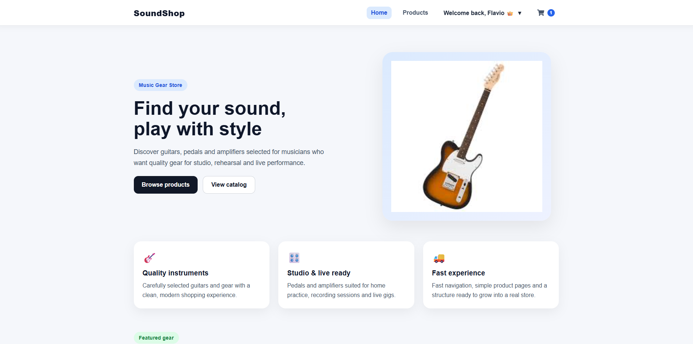
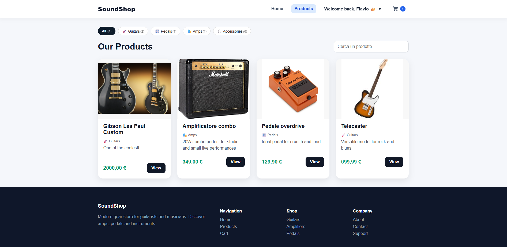
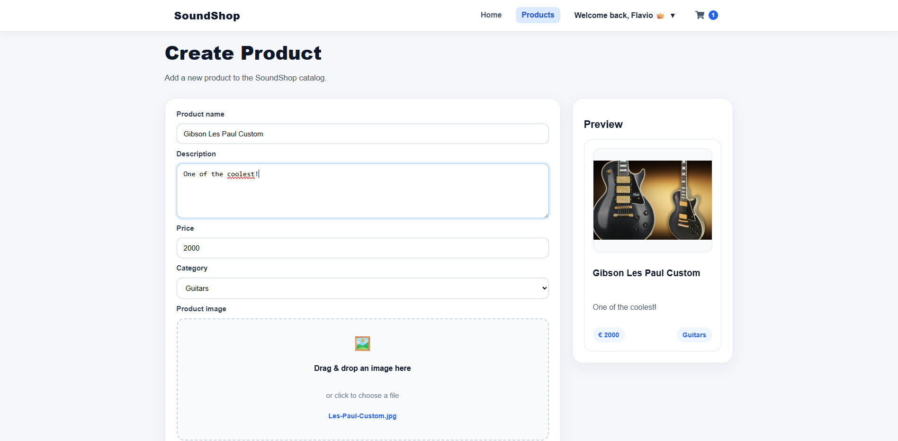
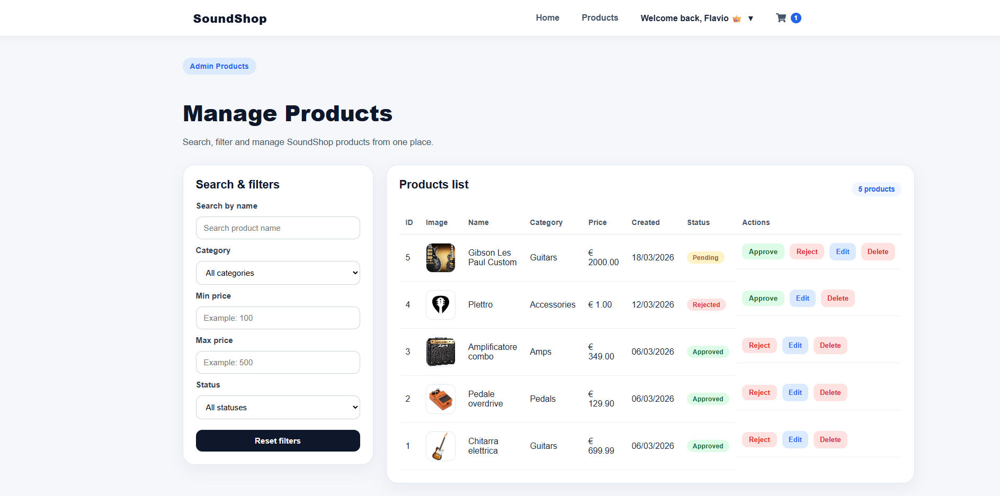

# 🎸 SoundShop

SoundShop is a full-stack e-commerce web application focused on music gear, designed to simulate a real-world online store with authentication, product management, and admin moderation.

---

## ✨ Features

### 👤 Authentication & Roles

* User registration and login
* Role-based access (User / Admin)
* Protected routes (frontend & backend)

### 🛒 Product Management

* Browse products with categories and filters
* Product cards with clean UI
* Product detail view

### 🛠️ Admin Dashboard

* Manage users (promote to admin, delete)
* Manage categories (create, edit, delete)
* Manage products:

  * Approve / Reject products
  * Edit / Delete products
  * Advanced filtering system

### ➕ Create Product (Advanced UX)

* Drag & drop image upload
* Live product preview
* Dynamic form handling

---

## 🧰 Tech Stack

### Frontend

* React
* React Router
* Axios
* CSS (custom styling)

### Backend

* Laravel (REST API)
* Authentication & authorization

### Database

* MySQL

---

## 📂 Project Structure

SoundShop/
│
├── backend/    → Laravel API
├── frontend/   → React application

---

## 📸 Screenshots

(Add your screenshots inside a `/screenshots` folder)

---

## ⚙️ Installation

### 🔧 Backend (Laravel)

cd backend
composer install
cp .env.example .env
php artisan key:generate

# configure DB in .env

php artisan migrate --seed
php artisan serve

---

### 💻 Frontend (React)

cd frontend
npm install
npm run dev

---

## 🔐 Environment Variables

Example backend `.env`:

DB_DATABASE=soundshop
DB_USERNAME=root
DB_PASSWORD=

APP_KEY=base64:your_app_key

---

## 🎯 Project Goals

* Build a realistic full-stack application
* Practice REST API design
* Implement role-based authorization
* Create a clean and modern UI/UX

---

## 🚀 Future Improvements

* Shopping cart & checkout
* Payment integration
* Cloud image storage (S3 / Cloudinary)
* Order management system
* Pagination & performance optimization

---

## 👨‍💻 Author

**Flavio Trettenero**

Full Stack Developer (React + Laravel)
Background in Philosophy

---

## 📬 Contact

Feel free to connect with me on LinkedIn!

